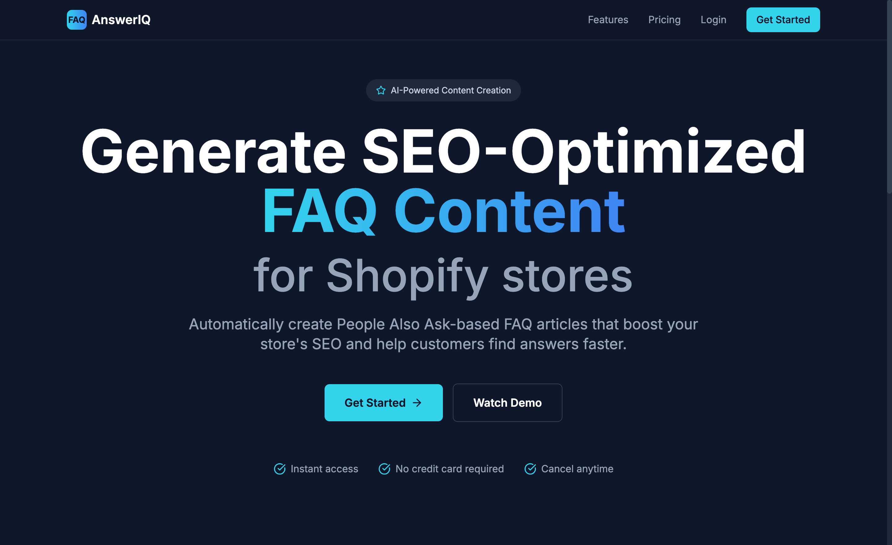
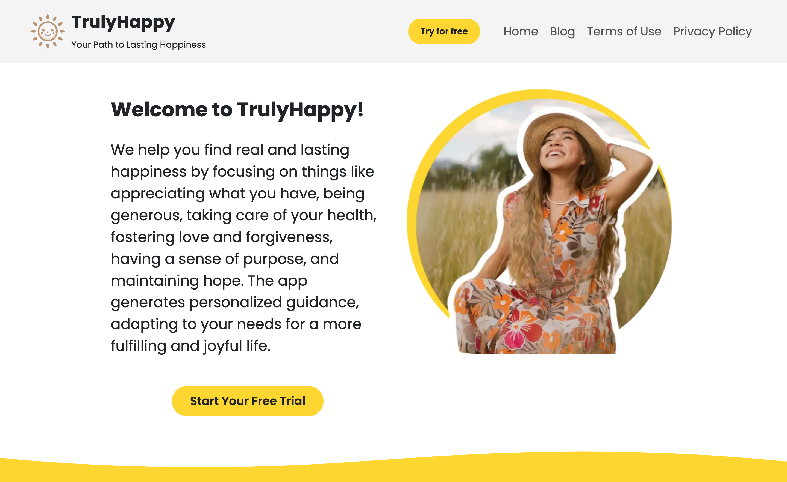

# 👨‍💻 Zeddrix Fabian - Software Engineer

> Passionate Software Engineer with expertise in full-stack development, cloud technologies, and modern web frameworks. Committed to writing clean, efficient, and scalable code while solving complex technical challenges.

---

## 🚀 About Me

I'm currently working at [Codefrost](https://codefrost.dev/), where we're revolutionizing software development through:

- 🤖 AI-powered development solutions and consulting
- 🚀 Custom SaaS product development and white-labeling
- 💡 Innovative AI integration strategies
- 📱 Progressive Web Apps (PWAs)
- 🌐 Full-stack development services

Our team combines decades of experience with cutting-edge AI tools to deliver exceptional software solutions. Through AI-Driven Coder, we share our expertise and empower developers worldwide.

---

## 🛠️ Technical Skills

### Programming Languages

### Frontend Development

### Backend Development

### DevOps & Cloud

### Tools & Technologies

---

## 🏆 Projects I've Contributed Development to

### [UseDelight](https://chromewebstore.google.com/detail/Nature%20Wallpapers%20HD%20video%20New%20Tab%20background/hehbgjdnbibkndghdlilefececadokpb)

Transform your new tab into a stunning, safe-for-work dashboard with UseDelight—perfect for classrooms, offices, and home users. Enjoy over 1,500 high-definition motion video backgrounds featuring breathtaking scenes from oceans, beaches, mountains, forests, waterfalls, deserts, and all four seasons. Each new tab brings you a fresh, immersive view of Earth's natural wonders, helping you relax, focus, and stay inspired throughout your day.

### AnswerIQ

Automatically create People Also Ask-based FAQ articles that boost your store's SEO and help customers find answers faster.

### [TrulyHappy](https://trulyhappy.app/)

Personalized guidance, adapting to your needs for a more fulfilling and joyful life.

---

## 📜 Certifications

View my certifications on [LinkedIn](https://www.linkedin.com/in/zeddrix-fabian-30a18029a/details/certifications/)

---

## 🌍 Languages

- **Tagalog:** Native
- **English:** Professional Working Proficiency

---

## 📫 Get In Touch

- 📧 **Email:** [zeddrix.fabian@codefrost.com](mailto:zeddrix.fabian@codefrost.com)
- 💼 **LinkedIn:** [zeddrix-fabian](https://www.linkedin.com/in/zeddrix-fabian-30a18029a/)
- 🌐 **Website:** [zeddrix.com](https://zeddrix.com)

---

## 🤝 Open for Collaboration

I'm always interested in connecting with fellow developers and potential collaborators. Whether you're interested in:

- 🤖 AI-powered development solutions
- 🌐 Full-stack web development
- 📱 Progressive Web Apps
- 🚀 SaaS projects

Feel free to reach out!

---

### ⭐ From [zeddrix](https://github.com/zeddrix)

