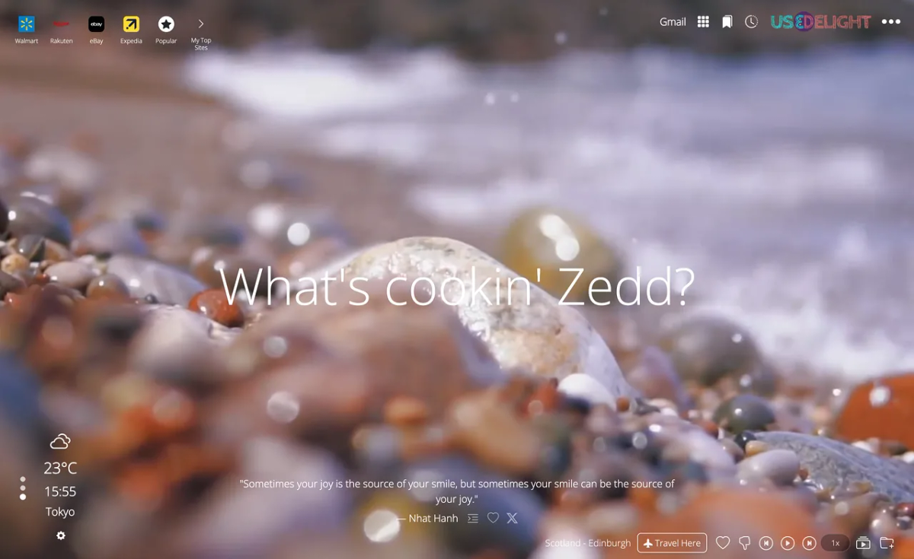
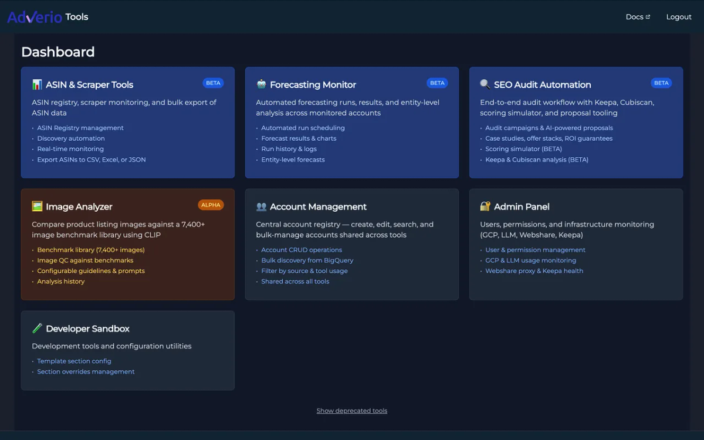
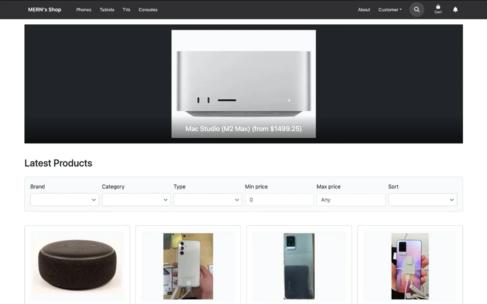
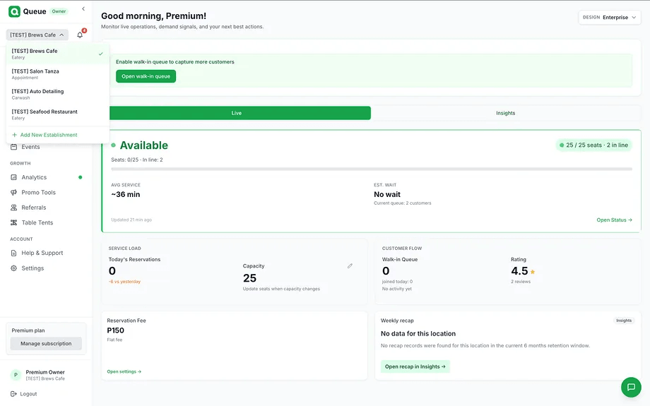
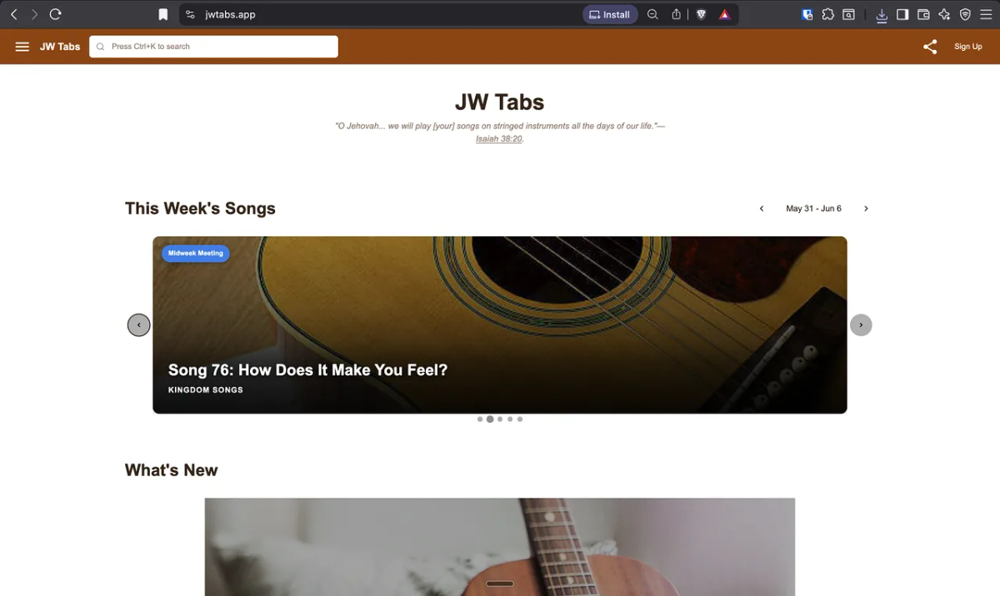
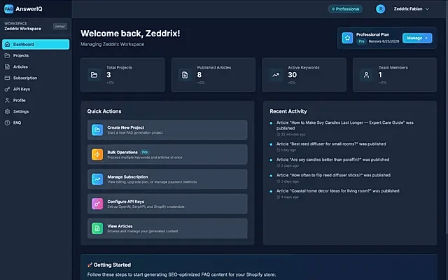
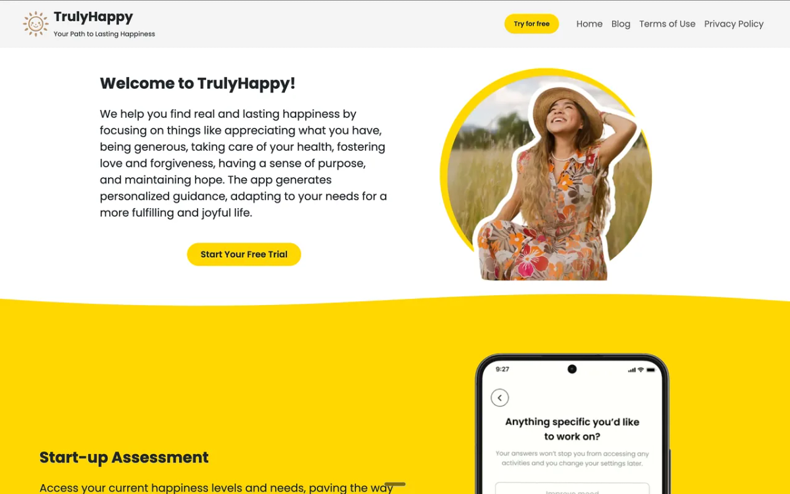
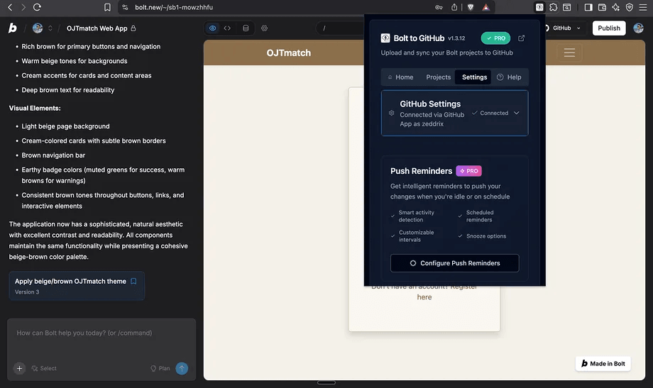

# Zeddrix Fabian

> Full-stack web app developer shipping production apps with AI-accelerated workflows.

---

## How I Deliver

- **Full-stack development** — End-to-end product work across frontend UX and backend logic, from API design to polished interfaces.
- **PWA** — Installable progressive web apps with responsive flows built for real-world mobile and desktop usage.
- **Billing integration** — Subscription and checkout flows with Stripe, Lemon Squeezy, and PayPal across client and personal products.
- **Admin Dashboard** — Owner and admin dashboards for operations, analytics, moderation, and day-to-day product control.
- **Chatbot** — AI-assisted support and guided workflows that help users move faster without adding UI complexity.
- **Docker Containerization** — Containerized services and repeatable environments for safer local development and production delivery.
- **Website Domain and Deployment** — Domain setup, hosting, and production rollout on Cloudflare and modern web deployment stacks.
- **Acceptance-test-driven development (ATDD)** — I define critical user journeys in focused end-to-end tests first, then layer integration and unit tests so each release ships with clear behavior and fewer regressions.

---

## Tools & Stack

**AI-accelerated delivery:**  
  

**Frontend frameworks:**  
      

**Frontend libraries & patterns:**  
    

**Languages:**  
  

**Backend & architecture:**  
-339933?style=flat&logo=nodedotjs&logoColor=white)      -85EA2D?style=flat&logo=swagger&logoColor=black) 

**Data & storage:**  
     

**Styling & UI:**  
    

**Testing:**  
      

**DevOps, platforms & workflow:**  
          

---

## About Me

I have been developing since 2018 and I enjoy turning complex requirements into simple user experiences with reliable engineering underneath.

I like to work smart, not hard. So I utilize AI tools like Cursor and Claude Code to move quickly without sacrificing quality, using the Acceptance Test-Driven Development (ATDD) approach.

I specialize in SvelteKit, React, and Angular while staying adaptable to product needs. With AI tools, I think it's not an exaggeration to say that I can work on any development project 'til shipped.

Shipping **11 live products** since **2018**, specializing in **SvelteKit, React, Angular**.

**Portfolio:** [zeddrix.github.io/portfolio](https://zeddrix.github.io/portfolio)

---

## Featured Projects

### [UseDelight](https://zeddrix.github.io/portfolio/projects/usedelight)

**Full-stack contributor** — Consistent web and Chrome extension experiences with subscription flows and content discovery.

Landing site and browser extension ecosystem

[Website](https://usedelight.com/) · [Chrome Extension](https://chromewebstore.google.com/detail/Nature%20Wallpapers%20HD%20video%20New%20Tab%20background/hehbgjdnbibkndghdlilefececadokpb)

**Stack:**  
   

### [Adverio Tools](https://zeddrix.github.io/portfolio/projects/adverio-tools)

**Full-stack contributor** — Connected scraping, AI analysis, forecasting, and proposal generation in one Amazon seller toolkit.

AI-assisted Amazon brand tooling suite

[Website](https://tools.adverio.io/) · [Proposal Sample](https://proposals.adverio.io/proposals/view/VU8JA16E/)

**Stack:**  
      

### [MERN's Shop](https://zeddrix.github.io/portfolio/projects/merns-shop)

**Sole builder** — Live electronics e-commerce with ~170 products, PayPal checkout, admin ops, installable PWA, and 100+ automated tests.

Full-stack MERN e-commerce with PWA and ATDD

[Live demo](https://merns-shop.onrender.com/) · [Source](https://github.com/zeddrix/merns-shop)

**Stack:**  
            

### [Queue](https://zeddrix.github.io/portfolio/projects/queue)

**Sole builder** — Unified walk-in, booking, and operations flows in one installable PWA with billing and admin tooling.

PWA for walk-ins, bookings, and operations

**Stack:**  
       

### [JW Tabs](https://zeddrix.github.io/portfolio/projects/jw-tabs)

**Sole builder** — Tablature rendering and community workflows with billing, moderation, and admin controls in one product surface.

Tablature platform for guitar and ukulele players

**Stack:**  
        

### [AnswerIQ](https://zeddrix.github.io/portfolio/projects/answeriq)

**Full-stack contributor** — Live multi-tenant SaaS that turns PAA queries into SEO FAQ articles, publishes to Shopify, bills via Stripe, and ships an admin console with audit logs — backed by Playwright, Jest, and Vitest ATDD.

AI-powered FAQ generation SaaS for Shopify SEO

[Live demo](https://answeriq.io/)

**Stack:**  
             

---

## More Projects

### [Manatal Coop](https://zeddrix.github.io/portfolio/projects/manatal-coop)

  
  
  

**Full-stack contributor** — Cooperative member banking PWA with financial request workflows, offline caching, and push notifications.

Member banking PWA for a Philippine credit union

[Portfolio case study](https://zeddrix.github.io/portfolio/projects/manatal-coop) · [Member app](https://manatalcoop.app/)

**Stack:**  
       

### TrulyHappy

**Full-stack contributor** — Mental wellbeing PWA with guided habits, mood tracking, missions, and subscription-ready billing.

Mental wellbeing PWA with guided habits and subscriptions

[Website](https://trulyhappy.app/)

**Stack:**  
      

### Articulearn

**Full-stack contributor** — Language speaking practice PWA with audio shadowing, segmented sessions, and subscription billing.

AI-assisted language speaking practice PWA

[Website](https://articulearn.app/)

**Stack:**  
     

### Bolt to Github

**Full-stack contributor** — Chrome extension that intercepts Bolt.new ZIP exports and pushes projects to GitHub with PAT or App auth.

Chrome extension bridging Bolt.new exports to GitHub repos

[Website](https://bolt2github.com/) · [Chrome Extension](https://chromewebstore.google.com/detail/pikdepbilbnnpgdkdaaoeekgflljmame)

**Stack:**  
  -4285F4?style=flat&logo=googlechrome&logoColor=white)   

---

## Certifications

| Course | Issuer | Completed | Verify |
|--------|--------|-----------|--------|
| Modern JavaScript From The Beginning | Udemy | Nov 2020 | [View certificate](https://zeddrix.github.io/portfolio/certificates/modern-javascript-from-the-beginning) |
| ReactJS Front to Back | Udemy | Jan 2021 | [View certificate](https://zeddrix.github.io/portfolio/certificates/reactjs-front-to-back) |
| CSS – The Complete Guide 2021 (incl. Flexbox, Grid & Sass) | Udemy | Feb 2021 | [View certificate](https://zeddrix.github.io/portfolio/certificates/css-complete-guide-2021) |
| Node.js API Masterclass With Express & MongoDB | Udemy | Mar 2021 | [View certificate](https://zeddrix.github.io/portfolio/certificates/nodejs-api-masterclass) |
| MERN eCommerce From Scratch | Udemy | Apr 2021 | [View certificate](https://zeddrix.github.io/portfolio/certificates/mern-ecommerce-from-scratch) |

All certifications: [portfolio certificates](https://zeddrix.github.io/portfolio/certificates)

---

## Languages

- **Tagalog:** Native
- **English:** Professional Working Proficiency

---

## Get In Touch

- **Email:** [zeddrix.fabian@gmail.com](mailto:zeddrix.fabian@gmail.com)
- **LinkedIn:** [zeddrix-fabian](https://www.linkedin.com/in/zeddrix-fabian-30a18029a/)
- **Portfolio:** [zeddrix.github.io/portfolio](https://zeddrix.github.io/portfolio)
- **GitHub:** [zeddrix](https://github.com/zeddrix)

---

## Open for Collaboration

I'm open to full-stack web development, AI-accelerated delivery, progressive web apps, and SaaS product work. Feel free to reach out.

---

### From [zeddrix](https://github.com/zeddrix)

